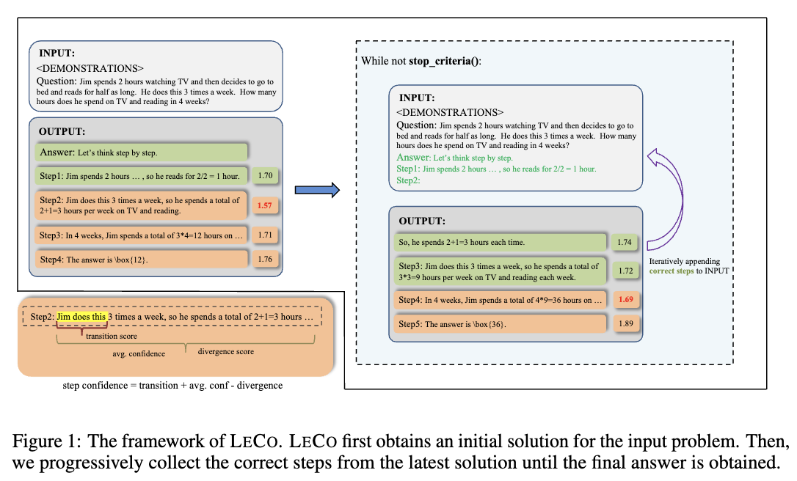

# LeCo: Learning From Correctness Without Prompting Makes LLM Efficient Reasoner
This is the implementation of paper LeCo: [Learning From Correctness Without Prompting Makes LLM Efficient Reasoner](https://arxiv.org/pdf/2403.19094), which is accepted to COLM 2024.

---

## Introduction:
Large language models (LLMs) have demonstrated outstanding performance across various tasks, yet they still exhibit limitations such as hallucination, unfaithful reasoning, and toxic content. One potential approach to mitigate these issues is learning from human or external feedback (e.g. tools). In this paper, we introduce an intrinsic self-correct reasoning framework for LLMs that eliminates the need for human feedback, external tools, and handcraft prompts. The proposed framework, based on a multi-step reasoning paradigm **Le**arning from **Co**rrectness (LECO), improves reasoning performance without needing to learn from errors. This paradigm prioritizes learning from correct reasoning steps, and a unique method to measure confidence for each reasoning step based on generation logits. Experimental results across various multi-step reasoning tasks demonstrate the effectiveness of the framework in improving reasoning performance with reduced token consumption.



## Usage:
For DeepSeek:

```
bash run_leco.sh
```

For GPT series:

```
bash run_gpt_leco.py
```

## Citation

```
@misc{yao2024learningcorrectnesspromptingmakes,
      title={Learning From Correctness Without Prompting Makes LLM Efficient Reasoner}, 
      author={Yuxuan Yao and Han Wu and Zhijiang Guo and Biyan Zhou and Jiahui Gao and Sichun Luo and Hanxu Hou and Xiaojin Fu and Linqi Song},
      year={2024},
      eprint={2403.19094},
      archivePrefix={arXiv},
      primaryClass={cs.CL},
      url={https://arxiv.org/abs/2403.19094}, 
}
```
